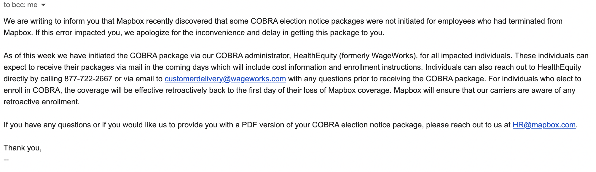

# Accessing Healthcare
## Contents
### 1. [COBRA](#cobra)
   - [What is COBRA?](#what-is-cobra)
   - [Who can elect COBRA?](#who-can-elect-cobra)
   - [How much does COBRA cost?](#how-much-does-cobra-cost)
   - [When does COBRA start?](#when-does-cobra-start)
   - [How long does COBRA last?](#how-long-does-cobra-last)
   - [Anything else I should know?](#anything-else-i-should-know)

### 2. [Alternate Healthcare Plans](#alternate-healthcare-plans)

### 3. [Marketplace Insurance](#marketplace-insurance)

### 4. [Medicaid](#medicaid)
  - [What's the difference between Medicaid and Medicare?](#whats-the-difference-between-medicaid-and-medicare)
  - [How Do I enroll in Medicaid?](#how-do-i-enroll-in-medicaid)
  - [What are the income requirements?](#what-are-the-income-requirements)

### 5. [Accessing Affordable Healthcare](#accessing-affordable-healthcare)
  - [Community Health Centers](#community-health-centers)
  - [Health Departments](#health-departments)
  - [Health Savings Cards and Plans](#health-savings-cards-and-plans)
  - [Telemedicine](#telemedicine)
  - [Other Tips](#other-tips)

---

# COBRA

## What is COBRA?

COBRA is a US federal act that requires all employers with > 20 employees to give their employees the _option_ of continuing their existing healthcare plan for a minimum of 2 months (60 days).

## Who can elect COBRA?

The affected employee and dependants previously on their employer's insurance plan can elect COBRA. In addition, COBRA can be elected independently. This means dependants can elect COBRA from this insurance plan even if the former plan holder chooses not to.

## How much does COBRA cost?

Affected employees/their dependants are responsible for the entirety of COBRA fees. This includes the entire premium and administrative fees. For a gold/platinum healthcare plan, this could cost about $700-$800/month for an individual.

## When does COBRA start?

Often (but not always), your regular health insurance plan should last until the end of the month after your termination date. Your employer should let you know the end date of your health insurance during your termination and in follow-up documentation. Mapbox doesn't always do this.

 The timeline for electing COBRA coverage looks like this:

- Your employer must notify your health insurance plan of your termination within **30 days** of that event

- Your insurance plan provider then has **14 days** to send notice to you. It will often arrive via mail, addressed from a benefits provider.

- You have 60 days from either one of these events:

  - When your plan creates/mails your notice OR
  - The date you would lose your coverage

  _(Whichever of these two events occurs later is the start of your 60 days)_

  You have 60 days to elect COBRA healthcare coverage. You even have the option of rejecting (waiving), changing your mind, and electing COBRA _as long as it is within 60 days_.

COBRA will start the first day after your employer coverage ends. You cannot 'skip' a month for reduced costs. If you choose to elect COBRA, you must pay for each month between the end of your regular employer coverage ends and the date of electing COBRA.

If, for example, you were laid off in January, your regular employer insurance should last until the end of January, and you should receive your COBRA election papers by mid-end February. However, if you want to elect COBRA for March, you must pay premiums for February and March.

## How long does COBRA last?

COBRA can last up to 18 months. However, a few events may trigger COBRA's early termination, [documented here](https://www.dol.gov/sites/dolgov/files/ebsa/about-ebsa/our-activities/resource-center/faqs/cobra-continuation-health-coverage-consumer.pdf). COBRA is often continued and paid for on a month-to-month basis so that individuals affected can change their healthcare as their situation changes.

## Anything else I should know?

1. The federal government requires all employers to offer COBRA, irrespective of the nature of your termination (whether fired or laid off). The only exception is gross misconduct. In this case, your employer and your plan *must* notify you that you are not eligible for COBRA.
   
2. Unfortunately, Mapbox has a history of failing to follow through with COBRA notices.

    <figure>
    
    <figcaption align = "center" text-size="2"><i>This late COBRA notice was never delivered</i></figcaption>
    </figure>

   While this is a violation of federal law, recourse is often limited. The US Department of Labor, specifically the EBSA department, administers the ERISA act (including COBRA). If this happens to you, you should contact a [regional office](https://www.dol.gov/agencies/ebsa/about-ebsa/about-us/regional-offices).

---

# Alternate healthcare plans

If you have another plan available, the loss of your healthcare is considered a _qualifying event_ that enables you to enroll in your partner's healthcare plan at any time of the year. You typically have 60 days from the date of loss of your healthcare to notify this alternative plan and enroll.

---

# Marketplace Insurance

Loss of health insurance is a qualifying event for enrolling in marketplace insurance. Each state has separate marketplace applications, but you can find links to your state's application at [healthcare.gov](https://www.healthcare.gov/). Unfortunately, marketplace insurance is limited because in-network providers are often _only_ in the state where you signed up. Emergency health care may be covered out-of-state.

# Medicaid

## What's the difference between Medicaid and Medicare?

(We give Medi-_care_ for the elderly, we give Medic-_aid_ to the poor)

## How do I enroll in Medicaid?

The application for Medicaid is typically the same application you'll use to apply for any marketplace insurance plan.

## What are the income requirements?

Most states have the same income level of $2,523/month for an individual and $5,046/month for a married couple. However, income limits can vary from state to state, so check your state's application forms.

Remember that while most states ask for your monthly income in these forms, Medicaid eligibility is calculated retroactively from _annual_ income. Meaning that if you earn $0 in the months following your job loss and thus qualify for Medicaid - but later start a new job, in that case, you may end up owing back up to $1250 in the following tax season. See [the following page on healthcare and federal taxes for more information](https://www.healthcare.gov/taxes/). It's essential to update your income on your marketplace insurance plan whenever a change in income occurs.

---

# Accessing Affordable Healthcare

Unfortunately, having health insurance is only half the battle when you're on a limited income. Even with insurance, there are still co-pays and deductibles, and out-of-pocket maximums. 

## Community Health Centers

The Affordable Care Act expanded funding for Community Health Centers throughout the United States. These are facilities with free or low-cost healthcare services. They are typically networks with locations throughout a single county (or city). Your intake form may ask about income, and bills will be assessed based on your ability to pay.

Many cities/counties offer medical (family/internal health, pediatric, and women's health) facilities, dental clinics, and mental/behavioral health.

Sometimes these clinics make appointments; other times, they offer care on a "first-come, first-serve" basis, where you'll need to show up early and wait until there's an opening to see you.

[Here's a map](https://findahealthcenter.hrsa.gov/) to find services near you.

## Health Departments
County Health Departments often provide Community Health clinics (on certain days of the week). 

Most states will also have 'free and reduced-cost healthcare clinics for more specialized healthcare; here's an example of the [Washington State Healthcare Access Alliance](https://www.wahealthcareaccessalliance.org/free-clinics). These are great foundations to consider giving back to when you have more funds.

## Health Savings Cards and Plans

- Some dental and vision savings plans are available for purchase -- usually around $150-$200/person/year. These are offered by regular health/dental/vision insurance companies and usually come with a network of providers that accept this plan. It's not insurance and cannot be combined with regular insurance -- but these plans can be used to access savings at dental/vision providers in the event of necessary procedures.

- If you had an HSA with your employer, any money in that account is _yours_, irrespective of whether or not you choose to continue with your employer plan. You can withdraw funds at any time, but it will be taxed as regular income if you decide to use funds for anything other than healthcare. In addition, you may need to pay administrative fees to transfer funds.

## Telemedicine

- [HealthTAP](https://www.healthtap.com/) is a subscription Telemedicine service to a doctor prescribing in your area - if you need regular prescriptions or managing a chronic condition. HealthTAP costs $15/month for the subscription and about $40 for a doctor's visit. 

## Other tips:

- If you have health insurance, sometimes your plan will have estimated costs per doctor or procedure.

- Preventative health visits (regular check-ups, etc.) are almost always 100% covered, whether or not your deductible has been met.

- Most major insurance plans have a free 24/7 Nurse hotline where you can discuss symptoms with a professional and determine whether or not you need to see a doctor.

- Urgent Care clinic visits usually range between $40-$100, and doctors at these clinics can address various issues.
